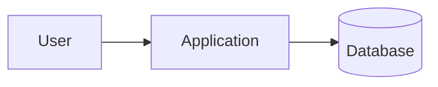

# Mermaid Diagrams

## Outcome

Write the smallest valid Mermaid definition that explains one relationship, process, plan, or data model. Keep identifiers simple and labels specific so the source remains easy to revise in Markdown.

## Choose the Diagram Type

- **Flowchart:** a process, decision, or service flow.
- **Sequence:** messages in time order between actors or systems.
- **Class, ER, or state:** domain structure, data relationships, or allowed states.
- **Gantt, timeline, or Git graph:** plans, milestones, and development history.
- **Mind map, pie, quadrant, Sankey, or XY chart:** exploration, proportions, prioritization, transfers, or trends.

For a homelab architecture, use a flowchart for a lightweight high-level view. Use PlantUML when a detailed deployment, network, or UML diagram is a better fit.

## Source Form

In Obsidian notes, use a `mermaid` fenced block. Mermaid has no shared start/end wrapper: the first non-comment line selects the diagram type.

````markdown

````

Use short, stable IDs such as `App` and `DB`; place human-readable text in node labels. Avoid the lowercase word `end` as a flowchart label because Mermaid parses it as syntax. Quote labels with punctuation or Markdown-sensitive characters.

## Layout and Readability

- Choose `LR` for a service path and `TD` for a procedure that reads top-to-bottom.
- Keep diagrams focused; split unrelated flows into separate blocks.
- Use subgraphs only when they communicate ownership or a real boundary.
- Prefer default styling. Add classes or theme settings only when color communicates meaning.
- Do not put credentials, tokens, private keys, or private configuration values in labels.

## Compatibility and Rendering

Obsidian renders Mermaid natively using its built-in diagram renderer. Mermaid features vary by version, so prefer established diagram types for reusable vault templates and test advanced types before relying on them.

## Validate Before Handoff

1. Confirm the fenced language is exactly `mermaid`.
2. Confirm the first source line is the intended diagram declaration.
3. Check that identifiers are unique and every relationship points to a declared or intentionally inferred item.
4. Render in Obsidian using its native Mermaid renderer and fix syntax, overflow, and ambiguous labels.

## Reference

Use the official Mermaid documentation for specialized syntax and current support: <https://mermaid.js.org/>.
