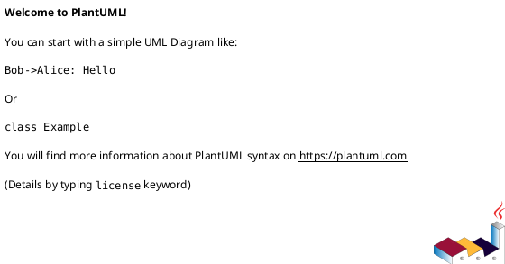
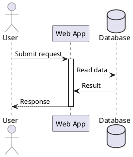
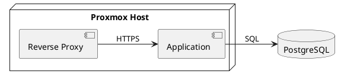
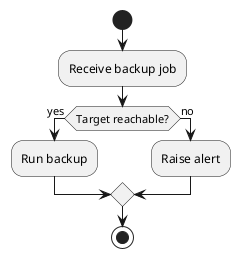

# PlantUML Diagrams

## Outcome

Write the smallest valid PlantUML source that clearly communicates one system relationship, process, or timeline. Keep source readable enough that a person can revise it without the generated image.

## Choose the Diagram Type

- **Sequence:** interactions over time between people, services, or components.
- **Component or deployment:** service boundaries, dependencies, hosts, and runtime placement. Prefer these for homelab architecture.
- **Class or object:** static domain models and type relationships.
- **Activity or state:** a process with branching, loops, or state transitions.
- **Network (`nwdiag`):** network segments, hosts, and connections.
- **Gantt, WBS, or mind map:** plans, work breakdown, or hierarchical exploration.

If the question is “what talks to what?” use a component/deployment diagram. If it is “in what order?” use a sequence diagram.

## Required Envelope

Use a matching start/end directive. For standard UML diagrams:

For Ditaa specifically, use `@startditaa` and `@endditaa`. Do not use `@startuml` followed by `ditaa`; that form is no longer supported. Ditaa renders PNG only.

Use a diagram-specific start directive where the language requires one, for example `@startgantt`, `@startmindmap`, or `@startnwdiag`, with its matching end directive.

Use a single quote (`'`) for comments. Keep every diagram self-contained unless shared source is explicitly requested.

## Reusable Patterns

### Sequence

`->` denotes a message and `-->` a dotted response. Declare participants when their order, alias, color, or shape matters; otherwise PlantUML can infer them.

### Component / Deployment

Use aliases (`as app`) when a displayed label contains spaces, punctuation, or line breaks. Label each connector with the protocol or relationship that matters.

### Branching Activity

## Layout and Readability

- Make labels short and specific; use notes for explanatory detail.
- Add `left to right direction` when a wide architecture reads better horizontally.
- Prefer aliases over fragile quoted identifiers in repeated references.
- Use groups, packages, nodes, or boundaries to show meaningful ownership—not decorative boxes.
- Add only the styling needed to distinguish real meaning. Avoid a large `skinparam` block unless a consistent visual system is requested.
- Split a dense diagram into focused views rather than shrinking text or crossing many lines.

## Safety and External Content

- Do not place passwords, tokens, private keys, or sensitive configuration values in source or labels.
- `!include`, remote includes, themes, sprites, and standard-library imports can load external content. Use them only when the user explicitly approves the dependency and its source.
- A renderer may send diagram source to a remote server. For Obsidian rendering, follow `plantuml-obsidian` and prefer local rendering for sensitive architecture.

## Validate Before Handoff

1. Confirm start/end directives match.
2. Confirm all aliases and referenced elements are declared or intentionally inferred.
3. Verify labels, arrow direction, and diagram type reflect the intended relationship.
4. Render the diagram in the target renderer and fix syntax or legibility errors.
5. For an Obsidian note, use a `plantuml` fenced block and follow `plantuml-obsidian` for viewer-specific behavior.

## Reference

This skill is based on the user-provided *PlantUML Language Reference Guide* (version 1.2025.0). Consult the full guide for specialized syntax rather than adding large syntax catalogs to this skill.
