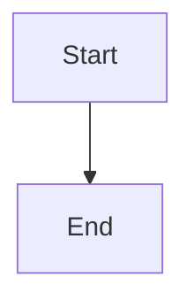

# Title

## Overview

Explain what this diagram shows and who benefits from it.

## Content

The default uses a `mermaid` fenced block. Use `plantuml` instead when its syntax is the better fit. See `templates/mermaid_diagrams/` and `templates/plantuml_diagrams/` for syntax and structure.

## Details

- **Element**: What it represents.
