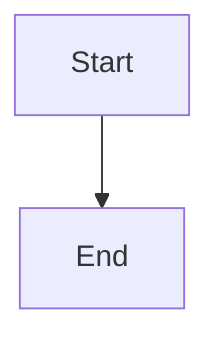

# diagram-type-diagram

## Purpose

Explain what this diagram shows and who benefits from it.

## Diagram

The default uses a `mermaid` fenced block. Use `plantuml` instead when its syntax is the better fit. See `templates/mermaid_diagrams/` and `templates/plantuml_diagrams/` for syntax and structure.

## Explanation

- **Element**: What it represents.

## Validation

- [ ] The diagram renders without errors in Obsidian.
- [ ] Labels are descriptive enough to understand without the source file.
- [ ] No sensitive or private information is included.

## Related

-