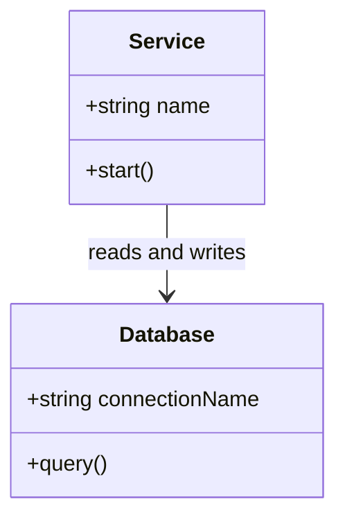

# Class Relationship Diagram

## Purpose

Use to describe a small domain model and the relationships between its types.

## Diagram

## Explanation

- **Class box**: A type with its fields and methods.
- **Fields**: Attributes with their data types and visibility (+ public).
- **Methods**: Operations with their signatures.
- **Relationships**: Lines showing associations (e.g. "reads and writes").

## Validation

- [ ] The diagram renders without errors in Obsidian.
- [ ] All types referenced in relationships have a declared class box.
- [ ] Visibility markers (+/-/#) match the intended access level.
- [ ] Field and method names are descriptive without the source file.
- [ ] No sensitive or private information is included.

## Related

-
