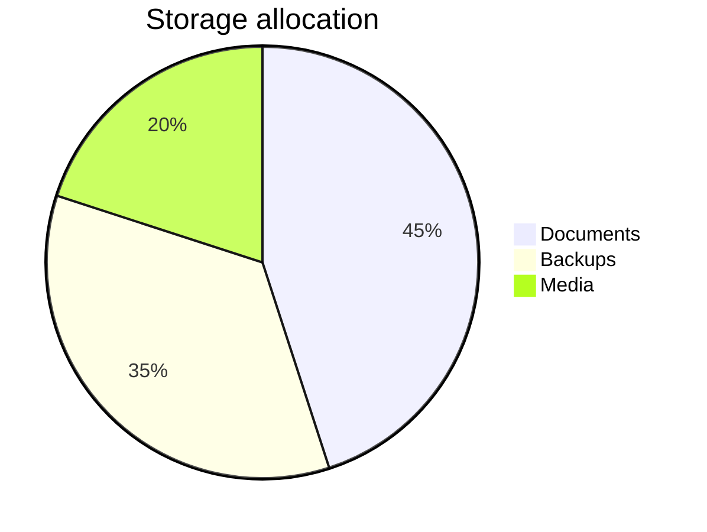

# Resource Distribution Pie Chart

## Purpose

Use to show how a whole is divided across a few clear categories.

## Diagram

## Explanation

- **Slices**: Categories as a proportion of the whole.
- **Values**: Numeric weights determining slice size (total determines the whole).

## Validation

- [ ] The diagram renders without errors in Obsidian.
- [ ] Categories sum to a meaningful whole.
- [ ] Labels are descriptive without the source file.
- [ ] No sensitive or private information is included.

## Related

-
