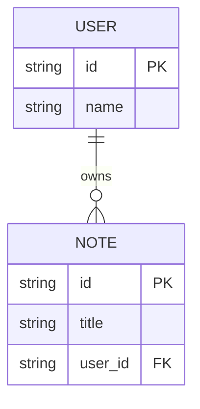

# Entity Relationship Data Model

## Purpose

Use to show entities, key fields, and cardinality in a small data model.

## Diagram

## Explanation

- **Entity box**: A data entity with its attributes.
- **Primary key (PK)**: The unique identifier for each record.
- **Foreign key (FK)**: A reference to another entity's key.
- **Relationships**: Cardinality between entities (e.g. one-to-many).

## Validation

- [ ] The diagram renders without errors in Obsidian.
- [ ] Each entity has at least one key field (PK).
- [ ] Foreign keys reference an existing entity.
- [ ] Cardinality markers accurately describe the relationship.
- [ ] No sensitive or private information is included.

## Related

-
