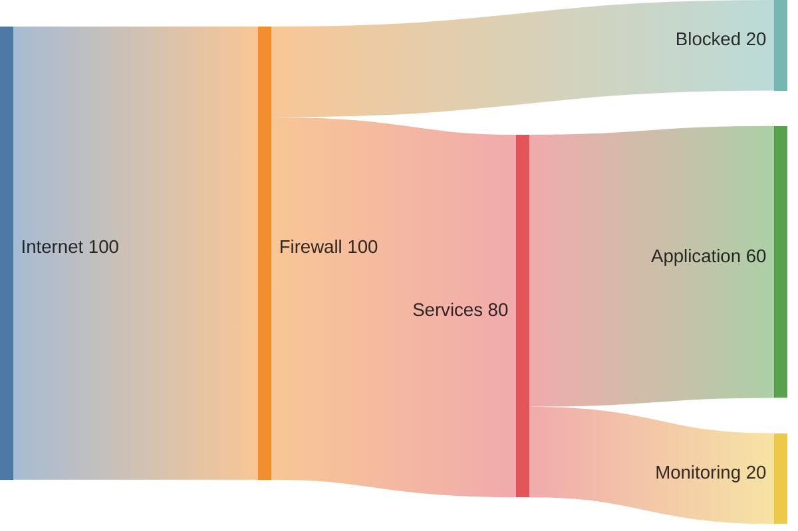

# Flow Allocation Sankey Diagram

## Purpose

Use to visualize quantities transferred between stages or categories.

## Diagram

## Explanation

- **Nodes**: Stages or categories in the flow (e.g. Internet, Firewall).
- **Links**: Quantities flowing between nodes.

## Validation

- [ ] The diagram renders without errors in Obsidian.
- [ ] All nodes have at least one input or output link.
- [ ] Quantities are realistic and roughly balanced.
- [ ] Labels are descriptive without the source file.
- [ ] No sensitive or private information is included.

## Related

-
