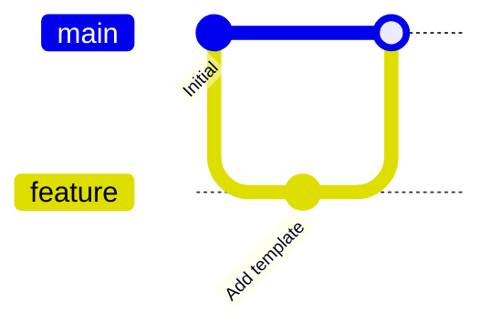

# Git Branching History

## Purpose

Use to explain a small branching and merge history.

## Diagram

## Explanation

- **Commits**: Points in the commit history with messages.
- **Branches**: Divergent lines of development.
- **Merges**: Points where branches rejoin the main line.

## Validation

- [ ] The diagram renders without errors in Obsidian.
- [ ] Branch names clearly indicate their purpose.
- [ ] Commit messages are descriptive in context.
- [ ] No sensitive or private information is included.

## Related

-
