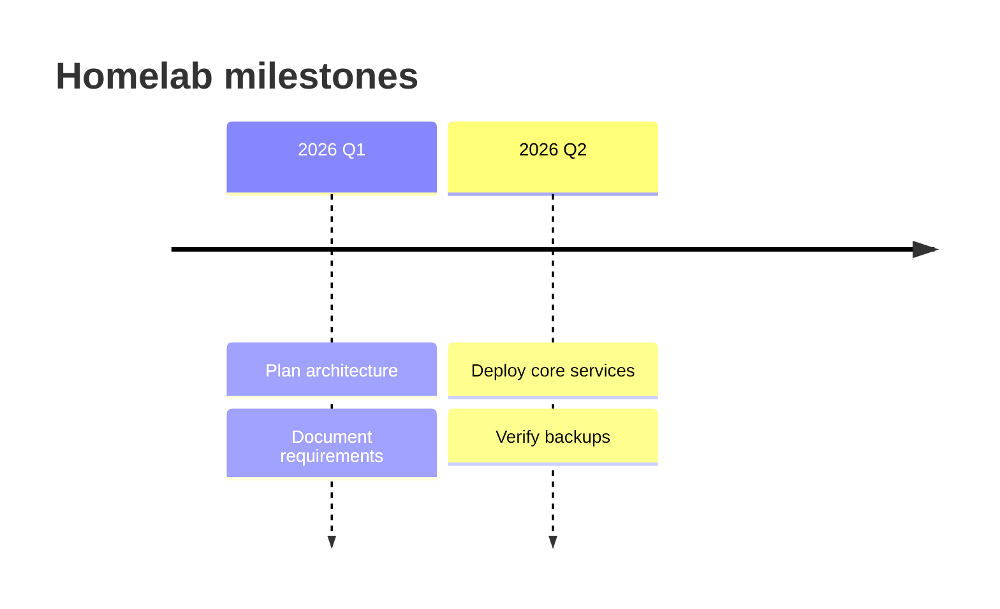

# Milestone Timeline

## Purpose

Use to summarize important events or phases without detailed task scheduling.

## Diagram

## Explanation

- **Sections**: Phases or time periods in the timeline.
- **Items**: Events or milestones within each section.

## Validation

- [ ] The diagram renders without errors in Obsidian.
- [ ] Sections and items follow a logical chronological order.
- [ ] Labels are descriptive without the source file.
- [ ] No sensitive or private information is included.

## Related

-
