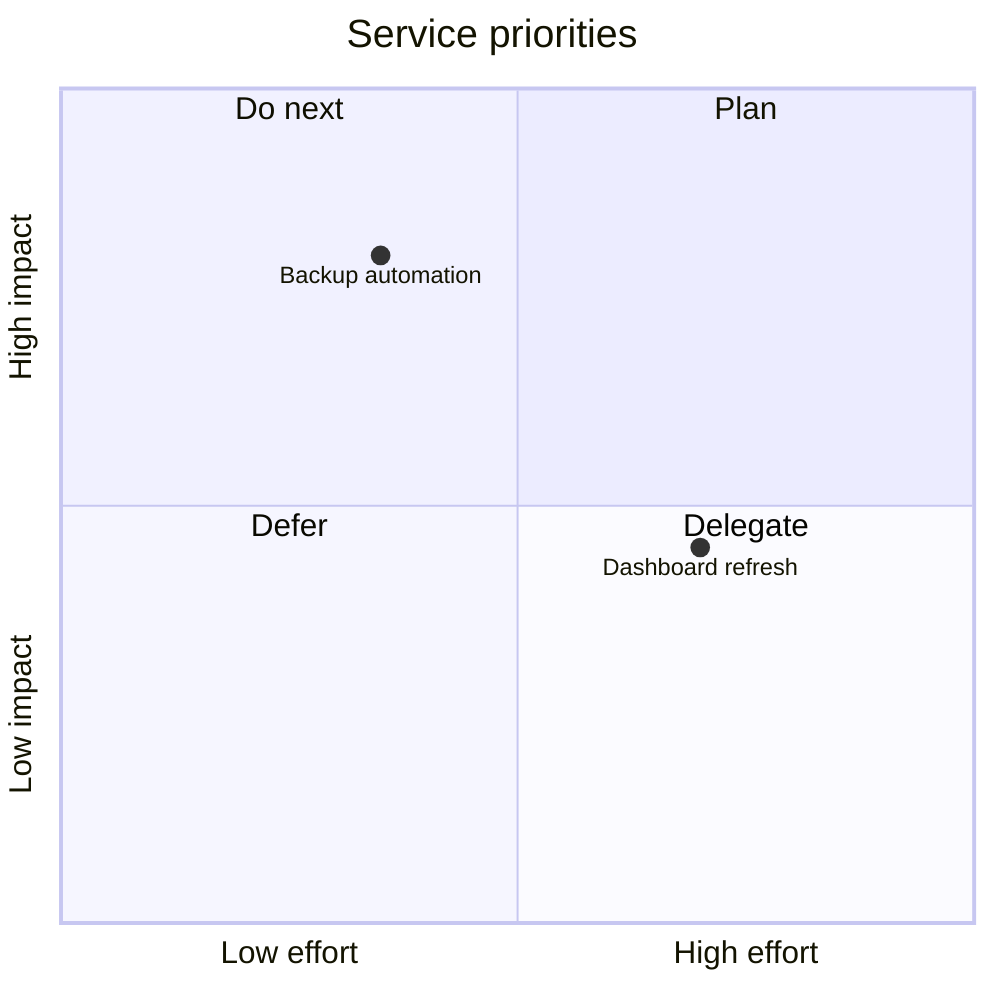

# Priority Quadrant

## Purpose

Use to compare work items across two decision criteria.

## Diagram

## Explanation

- **Quadrants**: Priority categories defined by two axes.
- **Items**: Work items plotted by their coordinates on the axes.
- **Axes**: Decision criteria (e.g. effort vs impact).

## Validation

- [ ] The diagram renders without errors in Obsidian.
- [ ] Quadrant labels clearly communicate each category.
- [ ] Items are placed in the correct quadrant for their priority.
- [ ] No sensitive or private information is included.

## Related

-
