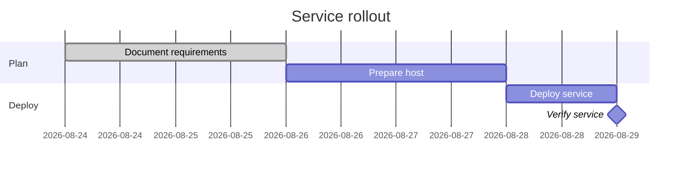

# Project Gantt Plan

## Purpose

Use to lay out sequential work, dependencies, and milestones on a calendar.

## Diagram

## Explanation

- **Sections**: Workstreams or phases in the project.
- **Tasks**: Named bars with start dates and durations.
- **Milestones**: Zero-duration markers for key events.
- **Dependencies**: Task sequencing via "after" relationships.

## Validation

- [ ] The diagram renders without errors in Obsidian.
- [ ] Task names clearly indicate the work item.
- [ ] Dates and durations are realistic for the plan.
- [ ] Milestones represent verifiable events.
- [ ] No sensitive or private information is included.

## Related

-
