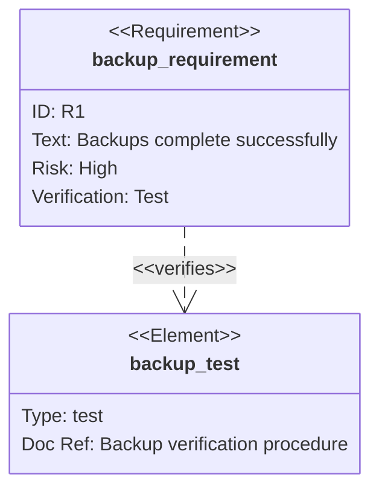

# Requirement Traceability Diagram

## Purpose

Use to connect a requirement to the element that verifies it.

## Diagram

## Explanation

- **Requirements**: Named elements with ID, text, risk, and verification method.
- **Elements**: Components that verify or satisfy requirements.
- **Relationships**: Traceability links (e.g. "verifies") between requirements and elements.

## Validation

- [ ] The diagram renders without errors in Obsidian.
- [ ] Every requirement has a unique ID.
- [ ] All requirements trace to at least one verifying element.
- [ ] Risk levels are assigned where relevant.
- [ ] No sensitive or private information is included.

## Related

-
