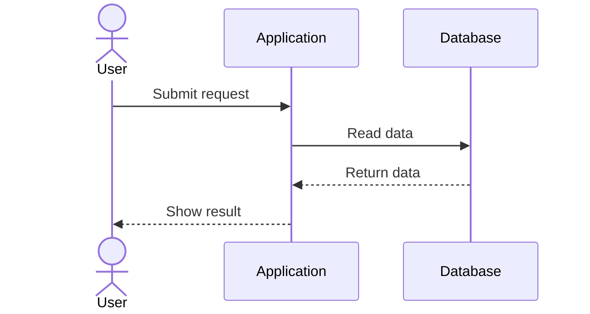

# Service Interaction Sequence

## Purpose

Use to show messages exchanged between a person, service, and dependency over time.

## Diagram

## Explanation

- **Actors/Participants**: People, services, or components exchanging messages.
- **Arrows**: Messages sent between participants.
- **Solid arrows**: Direct calls or requests.
- **Dashed arrows**: Responses or returns.

## Validation

- [ ] The diagram renders without errors in Obsidian.
- [ ] All messages have a sender and receiver.
- [ ] The sequence follows a logical temporal order.
- [ ] Responses match their corresponding requests.
- [ ] No sensitive or private information is included.

## Related

-
