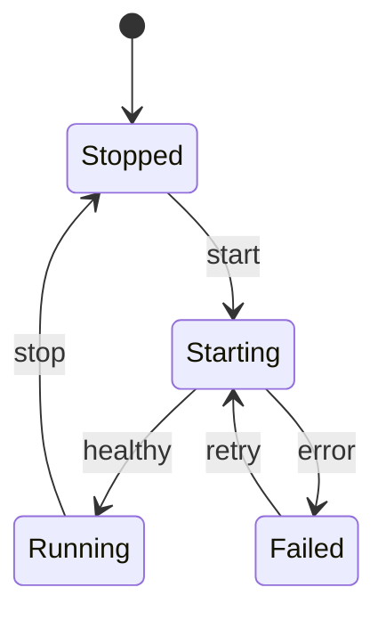

# Service State Machine

## Purpose

Use to document valid states and transitions for a service or workflow.

## Diagram

## Explanation

- **States**: Named conditions a service can be in.
- **Transitions**: Events that cause a state change.
- **Start/End**: Initial and terminal pseudo-states.

## Validation

- [ ] The diagram renders without errors in Obsidian.
- [ ] Every state has at least one transition leading to it.
- [ ] All states are reachable from the start state.
- [ ] Transition event names describe meaningful triggers.
- [ ] No sensitive or private information is included.

## Related

-
