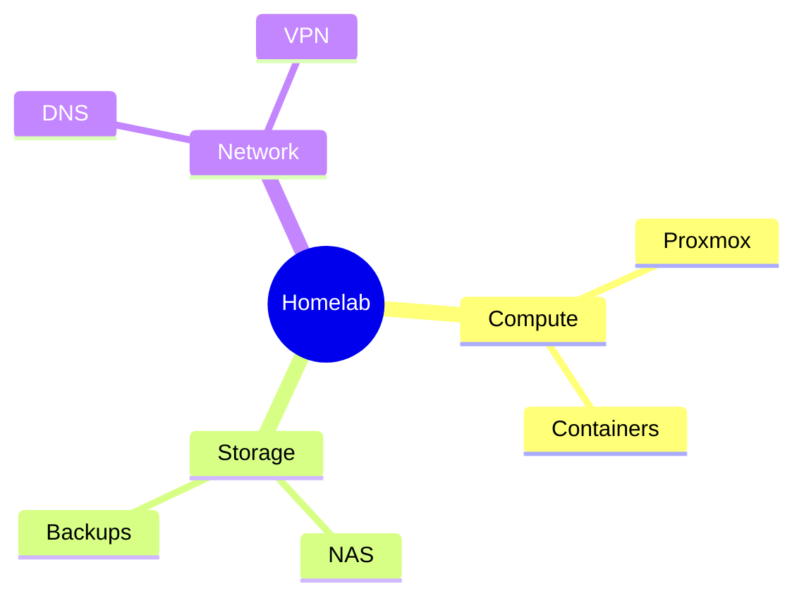

# Topic Exploration Mind Map

## Purpose

Use to explore a topic as a hierarchy before creating focused atomic notes.

## Diagram

## Explanation

- **Root node**: The central topic being explored.
- **Branches**: Major categories or sub-topics.
- **Leaves**: Specific ideas or details within each category.

## Validation

- [ ] The diagram renders without errors in Obsidian.
- [ ] Categories and sub-topics follow a logical hierarchy.
- [ ] Node labels are descriptive without the source file.
- [ ] No sensitive or private information is included.

## Related

-
