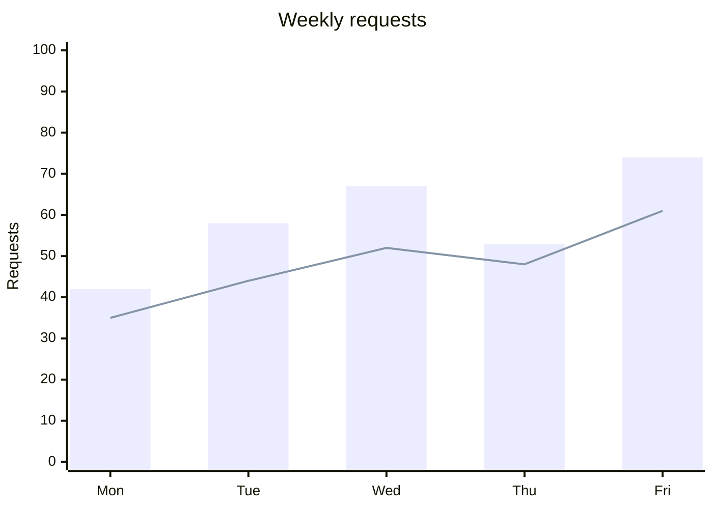

# XY Trend Chart

## Purpose

Use to compare a small series of values across an ordered axis.

## Diagram

## Explanation

- **X-axis**: The independent variable or time series.
- **Y-axis**: The dependent variable with a value range.
- **Bars**: Categorical or individual values.
- **Line**: A trend or second data series.

## Validation

- [ ] The diagram renders without errors in Obsidian.
- [ ] Axes are labeled with meaningful units.
- [ ] Data values match the visible chart elements.
- [ ] The chart type (bar/line) matches the data it presents.
- [ ] No sensitive or private information is included.

## Related

-
