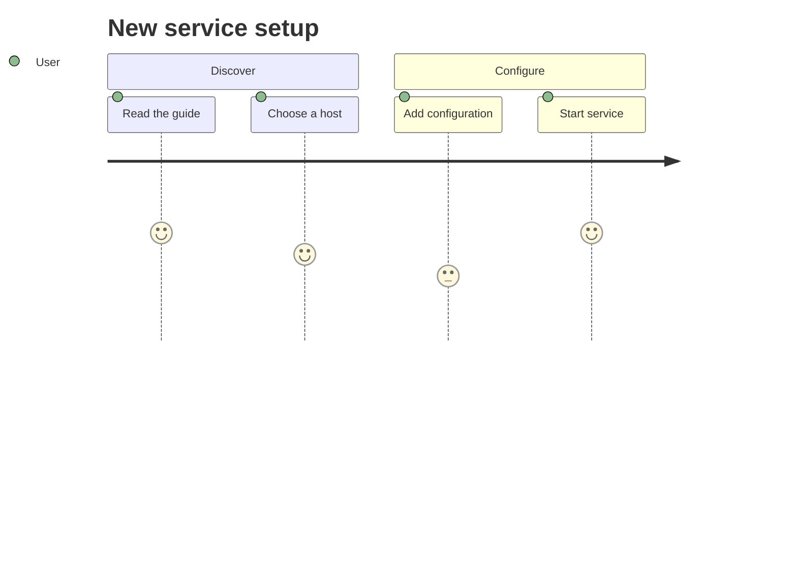

# User Journey

## Purpose

Use to capture a person's steps and perceived experience across a workflow.

## Diagram

## Explanation

- **Sections**: Phases or stages in the user's workflow.
- **Tasks**: Specific steps the user performs.
- **Scores**: User satisfaction ratings (1-5) for each step.
- **Actor**: The person whose journey is being mapped.

## Validation

- [ ] The diagram renders without errors in Obsidian.
- [ ] Sections follow a logical sequence.
- [ ] Task names describe concrete user actions.
- [ ] Satisfaction scores are realistic for the described experience.
- [ ] No sensitive or private information is included.

## Related

-
