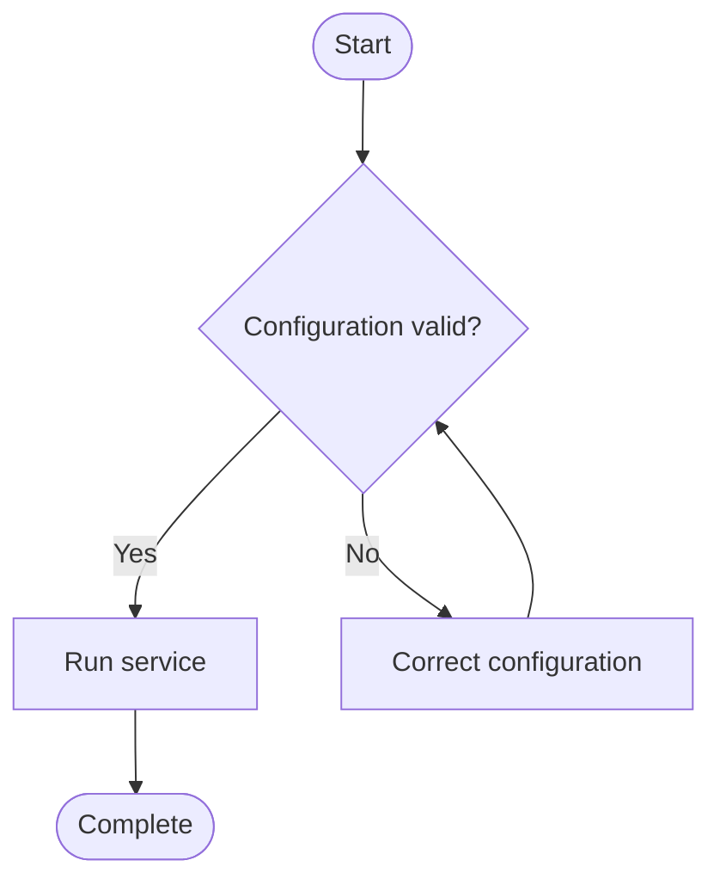

# Workflow Flowchart

## Purpose

Use to show a process, decision, and its possible outcomes.

## Diagram

## Explanation

- **Start/End nodes**: Entry and exit points of the process.
- **Decision diamond**: A branch point with yes/no outcomes.
- **Process box**: An action or step in the workflow.
- **Arrows**: Flow direction between steps.

## Validation

- [ ] The diagram renders without errors in Obsidian.
- [ ] All paths lead to a terminal node (no infinite loops).
- [ ] Decision branches cover all expected outcomes.
- [ ] Labels are descriptive without the source file.
- [ ] No sensitive or private information is included.

## Related

-
