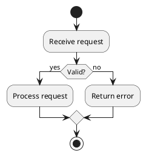

# Activity Diagram

## Purpose

Use to describe a workflow with actions, decisions, and outcomes.

## Diagram

## Explanation

- **Start/Stop**: Workflow entry and termination.
- **Actions**: Steps in the process.
- **Decisions**: Branch points with labeled outcomes.
- **Arrows**: Flow direction between actions.

## Validation

- [ ] The diagram renders without errors in Obsidian.
- [ ] Every path from start reaches a stop node.
- [ ] Decision branches cover all expected outcomes.
- [ ] Labels are descriptive without the source file.
- [ ] No sensitive or private information is included.

## Related

-
