# ArchiMate Diagram

## Purpose

Use to model enterprise architecture layers and their relationships; requires the ArchiMate standard library.

## Diagram

```plantuml
@startuml
' Requires the PlantUML ArchiMate standard library.
!include <archimate/Archimate>

Application_Component(App, "Application")
Technology_Node(Host, "Host")
Rel_Assignment(Host, App, "hosts")
@enduml
```

## Explanation

- **Application Component**: A software element providing application functionality.
- **Technology Node**: A physical or virtual infrastructure element.
- **Relationships**: Lines showing assignments or dependencies between layers.

## Validation

- [ ] The diagram renders without errors in Obsidian.
- [ ] The ArchiMate library include path is valid.
- [ ] Elements use the correct stereotype for their layer.
- [ ] Relationships use the correct ArchiMate notation.
- [ ] No sensitive or private information is included.

## Related

-
