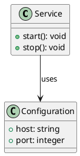

# Class Diagram

## Purpose

Use to model types, their fields and methods, and static relationships.

## Diagram

## Explanation

- **Class box**: A type with its fields and methods.
- **Fields**: Attributes with their data types.
- **Methods**: Operations with their signatures.
- **Relationships**: Lines showing associations between types.

## Validation

- [ ] The diagram renders without errors in Obsidian.
- [ ] All referenced types have a declared class box.
- [ ] Visibility markers (+/-/#) match the intended access level.
- [ ] No sensitive or private information is included.

## Related

-
