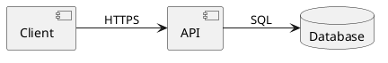

# Component Diagram

## Purpose

Use to show software components and the interfaces or protocols between them.

## Diagram

## Explanation

- **Components**: Software modules or services.
- **Interfaces/Protocols**: The communication method between components.
- **Dependencies**: Lines showing directional usage relationships.

## Validation

- [ ] The diagram renders without errors in Obsidian.
- [ ] All component dependencies are clearly annotated.
- [ ] Direction arrows show the correct data or call flow.
- [ ] No sensitive or private information is included.

## Related

-
