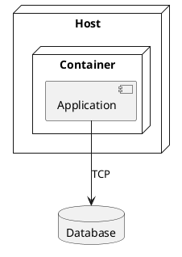

# Deployment Diagram

## Purpose

Use to map applications and services onto hosts, VMs, containers, or devices.

## Diagram

## Explanation

- **Nodes**: Physical or virtual hosts.
- **Containers**: Runtime environments within a host.
- **Components**: Applications deployed inside containers.
- **Databases**: Persistent storage systems.
- **Connections**: Communication protocols between elements.

## Validation

- [ ] The diagram renders without errors in Obsidian.
- [ ] Hosting hierarchy (node > container > component) is logical.
- [ ] Communication protocols are specified.
- [ ] No sensitive or private information is included.

## Related

-
