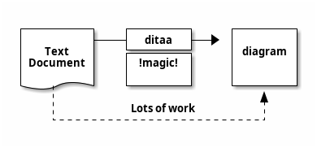

# Ditaa Diagram

## Purpose

Use to create ASCII-art shapes when a lightweight text-first technical diagram is enough. Ditaa renders as PNG only.

## Diagram

## Explanation

- **Boxes**: Represent components or systems.
- **Arrows**: Directional flow between boxes.
- **{d}**: Documentation stereotype for text-heavy boxes.
- **!magic!**: Ditaa renders text-art into clean shapes.

## Validation

- [ ] The diagram renders without errors in Obsidian (PNG mode).
- [ ] All box connectors align correctly after rendering.
- [ ] Text inside boxes remains readable.
- [ ] No sensitive or private information is included.

## Related

-
