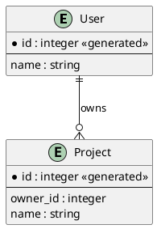

# Entity-Relationship Diagram

## Purpose

Use to model data entities, their fields, and cardinality relationships.

## Diagram

## Explanation

- **Entity**: A data entity with fields and constraints.
- **Primary key (*)**: The unique identifier for each record.
- **Generated**: Auto-incrementing or system-assigned keys.
- **Cardinality**: Relationship notation (e.g. one-to-many).

## Validation

- [ ] The diagram renders without errors in Obsidian.
- [ ] Every entity has a primary key.
- [ ] Foreign keys reference existing entities.
- [ ] Cardinality markers accurately describe the relationship.
- [ ] No sensitive or private information is included.

## Related

-
