# Gantt Chart

## Purpose

Use to plan tasks, durations, dependencies, and project milestones over time.

## Diagram

```plantuml
@startgantt
Project starts 2026-08-22

[Plan] lasts 2 days
[Build] lasts 3 days
[Build] starts at [Plan]'s end
[Review] lasts 1 day
[Review] starts at [Build]'s end
@endgantt
```

## Explanation

- **Tasks**: Named work items with defined start dates and durations.
- **Dependencies**: Task sequencing via "starts at [task]'s end".

## Validation

- [ ] The diagram renders without errors in Obsidian.
- [ ] Task names clearly indicate the work item.
- [ ] Dates and durations are realistic.
- [ ] Dependencies form a valid sequence (no circular references).
- [ ] No sensitive or private information is included.

## Related

-
