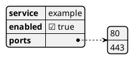

# JSON Data Diagram

## Purpose

Use to render JSON data as a readable structural diagram.

## Diagram

## Explanation

- **Keys**: Property names in the JSON structure.
- **Values**: The data values for each property.

## Validation

- [ ] The diagram renders without errors in Obsidian.
- [ ] The JSON is syntactically valid.
- [ ] Nested structures are clearly readable.
- [ ] No sensitive or private information is included.

## Related

-
