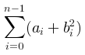

# LaTeX Formula

## Purpose

Use to render a standalone mathematical expression written in LaTeX notation.

## Diagram

## Explanation

- **Formula**: A mathematical expression rendered from LaTeX notation.

## Validation

- [ ] The diagram renders without errors in Obsidian.
- [ ] The LaTeX notation correctly represents the intended formula.
- [ ] No sensitive or private information is included.

## Related

-
