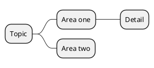

# Mind Map

## Purpose

Use to explore a topic as a hierarchy of ideas or categories.

## Diagram

## Explanation

- **Root**: The central topic being explored.
- **Branches**: Major categories or sub-topics.
- **Sub-branches**: Deeper levels of detail.

## Validation

- [ ] The diagram renders without errors in Obsidian.
- [ ] Categories follow a logical hierarchy.
- [ ] Node labels are descriptive without the source file.
- [ ] No sensitive or private information is included.

## Related

-
