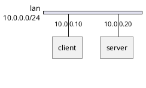

# Network Diagram (nwdiag)

## Purpose

Use to document network segments, addresses, and the devices attached to them.

## Diagram

## Explanation

- **Networks**: Logical or physical network segments with subnet addresses.
- **Devices**: Hosts, clients, or servers attached to a network.
- **Addresses**: IP addresses assigned to each device.

## Validation

- [ ] The diagram renders without errors in Obsidian.
- [ ] Network addresses use valid CIDR notation.
- [ ] Device addresses fall within their assigned network range.
- [ ] No sensitive or private information is included.

## Related

-
