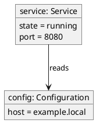

# Object Diagram

## Purpose

Use to show a concrete snapshot of objects and their current values.

## Diagram

## Explanation

- **Objects**: Concrete instances with their current state values.
- **Fields**: The attributes and their runtime values.
- **Links**: Relationships between instances.

## Validation

- [ ] The diagram renders without errors in Obsidian.
- [ ] Object names include their type in the format "name: Type".
- [ ] State values are realistic examples.
- [ ] No sensitive or private information is included.

## Related

-
