# SDL Diagram

## Purpose

Use to show message processing and input/output actions with SDL stereotypes.

## Diagram

```plantuml
@startuml
start
:Receive input; <<input>>
:Process message; <<procedure>>
:Send output; <<output>>
end
@enduml
```

## Explanation

- **Input**: Receiving a signal or message.
- **Procedure**: Processing or computation step.
- **Output**: Sending a signal or result.
- **«input» / «output» / «procedure»**: SDL stereotypes on actions.

## Validation

- [ ] The diagram renders without errors in Obsidian.
- [ ] SDL stereotypes are applied to the correct action types.
- [ ] The procedure has clear start and end points.
- [ ] No sensitive or private information is included.

## Related

-
