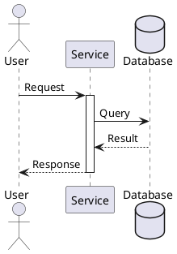

# Sequence Diagram

## Purpose

Use to show messages and responses between people, services, or systems over time.

## Diagram

## Explanation

- **Participants**: People, services, or systems exchanging messages.
- **Activation bars**: Period during which a participant is active.
- **Solid arrows**: Direct calls or requests.
- **Dashed arrows**: Responses or returns.

## Validation

- [ ] The diagram renders without errors in Obsidian.
- [ ] All messages have a sender and receiver.
- [ ] Activation and deactivation match request/response pairs.
- [ ] The sequence follows a logical temporal order.
- [ ] No sensitive or private information is included.

## Related

-
