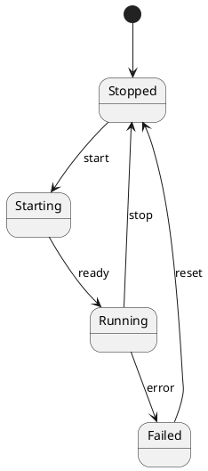

# State Diagram

## Purpose

Use to show valid states and the events that transition between them.

## Diagram

## Explanation

- **States**: Named conditions an entity can be in.
- **[*]**: Initial and terminal pseudo-states.
- **Transitions**: Events that cause a state change.

## Validation

- [ ] The diagram renders without errors in Obsidian.
- [ ] Every state is reachable from the initial state.
- [ ] Transition events describe meaningful triggers.
- [ ] No sensitive or private information is included.

## Related

-
