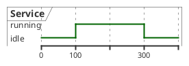

# Timing Diagram

## Purpose

Use to visualize state changes and events against a timeline.

## Diagram

## Explanation

- **Participants**: Services or components whose state changes over time.
- **States**: Named conditions at a given time period.
- **Time markers**: Points on the timeline where state changes occur.

## Validation

- [ ] The diagram renders without errors in Obsidian.
- [ ] State names are consistent across the timeline.
- [ ] Time intervals between events are realistic.
- [ ] No sensitive or private information is included.

## Related

-
