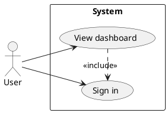

# Use-Case Diagram

## Purpose

Use to show which actors interact with a system and its capabilities.

## Diagram

## Explanation

- **Actors**: People or external systems interacting with the system.
- **Use cases**: Capabilities or features the system provides.
- **Relationships**: Lines showing which actors can access which use cases.
- **«include»**: A use case that depends on another.

## Validation

- [ ] The diagram renders without errors in Obsidian.
- [ ] Every actor has at least one associated use case.
- [ ] Use case names describe business capabilities, not technical steps.
- [ ] Include/extend relationships point in the correct direction.
- [ ] No sensitive or private information is included.

## Related

-
