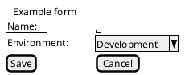

# Wireframe Diagram (Salt)

## Purpose

Use to sketch a simple user interface, form, or dialog without visual design tooling.

## Diagram

## Explanation

- **{T}**: Title bar at the top of a dialog or form.
- **Input fields**: Text entry areas with labels.
- **Dropdown**: A selectable option marked with ^value^.
- **Buttons**: Action buttons like Save or Cancel.

## Validation

- [ ] The diagram renders without errors in Obsidian.
- [ ] All interactive elements have clear labels.
- [ ] The layout matches the intended user interface.
- [ ] No sensitive or private information is included.

## Related

-
