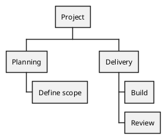

# Work Breakdown Structure

## Purpose

Use to break a project into progressively smaller work items.

## Diagram

## Explanation

- **Root**: The project being decomposed.
- **Level 1 branches**: Major phases or workstreams.
- **Level 2 branches**: Specific work packages or deliverables.

## Validation

- [ ] The diagram renders without errors in Obsidian.
- [ ] Each level represents a progressively detailed breakdown.
- [ ] Branch labels describe concrete deliverables or work items.
- [ ] No sensitive or private information is included.

## Related

-
