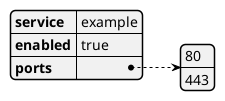

# YAML Data Diagram

## Purpose

Use to render YAML configuration or data as a readable structural diagram.

## Diagram

## Explanation

- **Keys**: Property names in the YAML structure.
- **Values**: Data values for each property.
- **Lists**: Ordered sequences of items under a key.

## Validation

- [ ] The diagram renders without errors in Obsidian.
- [ ] The YAML is syntactically valid.
- [ ] Nested structures are clearly readable.
- [ ] No sensitive or private information is included.

## Related

-
